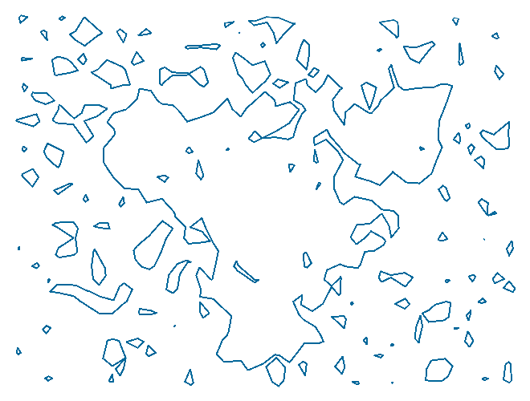
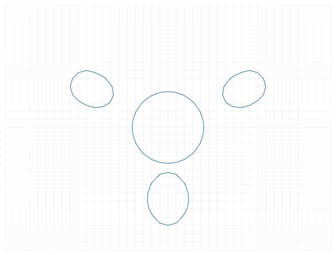

# marching-squares

<video controls autoplay muted width="500" src="screenshots/marching-squares-01.webm" type="video/webm"></video>

## Examples

[file-saver]: https://ghub.io/file-saver
[recordrtc]: https://github.com/muaz-khan/RecordRTC
[RecordRTC-web]: https://recordrtc.org
[html-video]: https://developer.mozilla.org/en-US/docs/Web/HTML/Element/video
[html-video-recording-tutorial]: https://medium.com/@amatewasu/how-to-record-a-canvas-element-d4d0826d3591
